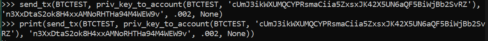
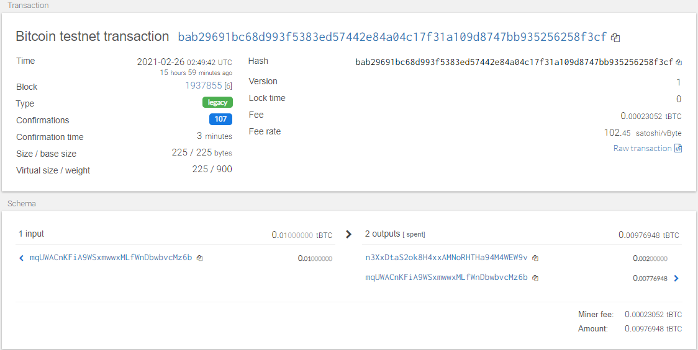
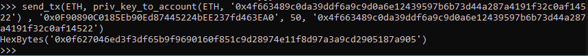
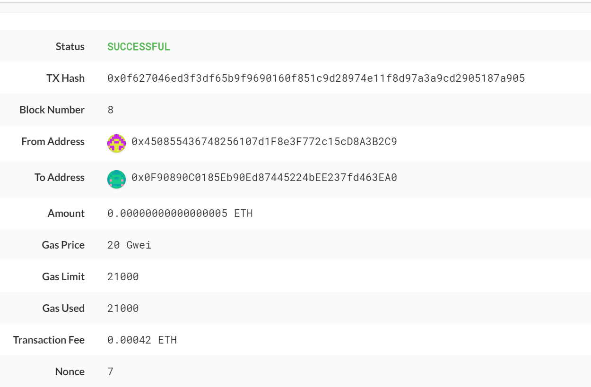

# Multi-Wallet-Blockchain-Python

Multi-Wallet Blockchain using Python

**Gregory Terrinoni - Unit 19**


## Bitcoin Testnet Transaction





## ETH Transaction





## Python Code for generating and sending transactions:

```python

def priv_key_to_account(coin, priv_key):
    
    if coin == 'eth':
        
        return Account.privateKeyToAccount(priv_key)
    
    elif coin == "btc-test":
        
        return bit.PrivateKeyTestnet(priv_key)
    
def create_tx(coin, account, to, amount):
    
    if coin == 'eth':
        
        gasEstimate = w3.eth.estimateGas({'from': account.address, 
                       'to': to, 'value': amount})
        
        transaction = {'nonce': w3.eth.getTransactionCount(account.address), 
                       'gasPrice': w3.eth.gasPrice, 
                       'gas': gasEstimate,
                       'to':to, 
                       'from': account.address, 
                       'value':amount}
        
        return transaction
        
    elif coin == "btc-test":
        
        transaction = bit.PrivateKeyTestnet.prepare_transaction(account.address, [(to, amount, BTC)])
        
        return transaction

def send_tx(coin, account, to, amount, priv_key):

        if coin == 'eth':
            
            raw_tx = create_tx(coin, account, to, amount)
            signed_tx = w3.eth.account.sign_transaction(raw_tx, priv_key)
            
            return w3.eth.sendRawTransaction(signed_tx.rawTransaction)
        
        elif coin == "btc-test":
            
            raw_tx = create_tx(coin, account, to, amount)
            signed_tx = account.sign_transaction(raw_tx)
            
            return bit.network.NetworkAPI.broadcast_tx_testnet(signed_tx)

```

## Description of Code

The wallet.py file derives all addresses and keys from a given mnemonic phrase.  From these addresses and keys you can pass them into the following functions:

priv_key_to_account: Derives wallet addresses from private keys

create_tx: creates data structure to pass along to be signed and sent

send_tx: signs the created raw message and sends it to the blockchain.

send_tx draws on the other 2 functions to send your transaction to either the ETH or BTC testnet network.

This python file relies on php and hd_wallet_derive code as well as other dependencies listed in the requirements.txt.


## Installation Instructions

*Please see requirements.txt for all necessary dependencies*

**hd_wallet_derive instructions:**

For Windows, open bash terminal as admin.  Navigate to your folder you want to install hd_wallet_derive and execute the following command:

  git clone https://github.com/dan-da/hd-wallet-derive
  cd hd-wallet-derive
  curl https://getcomposer.org/installer -o installer.php
  php installer.php
  php composer.phar install
